# Database Entity-Relationship Diagram (ERD)

This document provides a visual representation of the database schema and a detailed data dictionary for the **Laravel Starter** project.

---

## 1. Visual ERD (Mermaid)

Below is the entity-relationship diagram visualizing core tables, Spatie RBAC tables, and Passport OAuth tables.

```mermaid
erDiagram
    %% Core Relationships
    USERS ||--o{ USER_DEVICES : "possesses"
    USERS ||--o{ NOTIFICATIONS : "receives"
    REGIONS |o--o{ REGIONS : "parent-child hierarchy"

    %% Spatie RBAC Relationships
    USERS }|--|{ ROLES : "model_has_roles"
    USERS }|--|{ PERMISSIONS : "model_has_permissions"
    ROLES }|--|{ PERMISSIONS : "role_has_permissions"

    %% Laravel Passport Relationships
    USERS ||--o{ OAUTH_ACCESS_TOKENS : "owns"
    OAUTH_ACCESS_TOKENS ||--o{ OAUTH_REFRESH_TOKENS : "has"

    USERS {
        bigint id PK
        string name
        string email UK
        string phone UK "nullable"
        string password
        string avatar "nullable"
        boolean is_active
        timestamp email_verified_at "nullable"
        timestamp phone_verified_at "nullable"
        string remember_token "nullable"
        timestamp created_at "nullable"
        timestamp updated_at "nullable"
    }

    USER_DEVICES {
        ulid id PK
        bigint user_id FK
        string device_id
        string platform "android | ios"
        string os_version "nullable"
        string app_version "nullable"
        string device_name "nullable"
        string push_token "nullable"
        timestamp last_active_at "nullable"
        timestamp created_at "nullable"
        timestamp updated_at "nullable"
    }

    NOTIFICATIONS {
        ulid id PK
        bigint user_id FK
        string title
        text body
        jsonb data "nullable"
        string type
        timestamp read_at "nullable"
        timestamp sent_at "nullable"
        timestamp failed_at "nullable"
        timestamp created_at "nullable"
        timestamp updated_at "nullable"
    }

    OTP_CODES {
        bigint id PK
        string phone
        string code
        string purpose "login | verification | reset"
        timestamp expires_at
        timestamp used_at "nullable"
        string ip_address "nullable"
        timestamp created_at "nullable"
        timestamp updated_at "nullable"
    }

    CATEGORIES {
        bigint id PK
        string name
        string slug UK
        text description "nullable"
        boolean is_active
        timestamp deleted_at "nullable (soft delete)"
        timestamp created_at "nullable"
        timestamp updated_at "nullable"
    }

    REGIONS {
        bigint id PK
        bigint parent_id FK "nullable"
        string type "country | state | city | district | village"
        string code UK
        string name
        string phone_code "nullable"
        jsonb meta "nullable"
        timestamp created_at "nullable"
        timestamp updated_at "nullable"
    }

    APP_CONFIGS {
        bigint id PK
        string key UK
        text value "nullable"
        string type "string | boolean | integer | json"
        text description "nullable"
        timestamp created_at "nullable"
        timestamp updated_at "nullable"
    }

    APP_VERSIONS {
        bigint id PK
        string platform "android | ios"
        string min_version
        string latest_version
        boolean force_update
        string store_url "nullable"
        text release_notes "nullable"
        timestamp created_at "nullable"
        timestamp updated_at "nullable"
    }

    ROLES {
        bigint id PK
        string name UK
        string guard_name
        timestamp created_at "nullable"
        timestamp updated_at "nullable"
    }

    PERMISSIONS {
        bigint id PK
        string name UK
        string guard_name
        timestamp created_at "nullable"
        timestamp updated_at "nullable"
    }

    OAUTH_ACCESS_TOKENS {
        string id PK "length 100"
        bigint user_id FK "nullable"
        bigint client_id FK
        string name "nullable"
        text scopes "nullable"
        boolean revoked
        timestamp expires_at "nullable"
        timestamp created_at "nullable"
        timestamp updated_at "nullable"
    }

    OAUTH_REFRESH_TOKENS {
        string id PK "length 100"
        string access_token_id FK "length 100"
        boolean revoked
        timestamp expires_at "nullable"
    }
```

---

## 2. Data Dictionary

### 2.1 Core Tables

#### `users`
Stores user profile information, authentication credentials, and status flags.
- **`id`** (`bigint`, Primary Key, Auto Increment): Unique identifier for each user.
- **`name`** (`varchar(255)`): User's full name.
- **`email`** (`varchar(255)`, Unique): User's email address (used for login and verification).
- **`phone`** (`varchar(255)`, Unique, Nullable): User's phone number.
- **`password`** (`varchar(255)`): Hashed password.
- **`avatar`** (`varchar(255)`, Nullable): Path/URL to user's profile picture.
- **`is_active`** (`boolean`, Default: `true`): Flag to enable/disable user accounts.
- **`email_verified_at`** (`timestamp`, Nullable): Timestamp when the email was verified.
- **`phone_verified_at`** (`timestamp`, Nullable): Timestamp when the phone was verified.
- **`remember_token`** (`varchar(100)`, Nullable): Token for "remember me" session functionality.
- **`created_at` / `updated_at`** (`timestamp`, Nullable): Standard Eloquent timestamps.

#### `user_devices`
Tracks user devices used to access the application and stores push notification tokens.
- **`id`** (`char(26)`, Primary Key): Unique ULID for the device record.
- **`user_id`** (`bigint`, Foreign Key -> `users.id`, Cascades): The user associated with the device.
- **`device_id`** (`varchar(255)`): Unique identifier generated by the client application.
- **`platform`** (`varchar(255)`): Operating system of the device (`android` or `ios`).
- **`os_version`** (`varchar(255)`, Nullable): OS version version (e.g., `"Android 14"`, `"iOS 17.2"`).
- **`app_version`** (`varchar(255)`, Nullable): Version of the client application installed.
- **`device_name`** (`varchar(255)`, Nullable): Human-readable device name (e.g., `"Samsung S24"`, `"iPhone 15 Pro"`).
- **`push_token`** (`varchar(255)`, Nullable): FCM/APNs token used to target push notifications.
- **`last_active_at`** (`timestamp`, Nullable): Last activity time of the device.
- **`created_at` / `updated_at`** (`timestamp`, Nullable): Standard Eloquent timestamps.

#### `notifications`
Stores history and delivery status of in-app/push notifications dispatched to users.
- **`id`** (`char(26)`, Primary Key): Unique ULID for the notification record.
- **`user_id`** (`bigint`, Foreign Key -> `users.id`, Cascades): Recipient user.
- **`title`** (`varchar(255)`): Notification title.
- **`body`** (`text`): Notification body text.
- **`data`** (`jsonb`, Nullable): Arbitrary payload for deep-linking or custom UI handling.
- **`type`** (`varchar(255)`): Notification classification or category.
- **`read_at`** (`timestamp`, Nullable): Timestamp when marked read by the user.
- **`sent_at`** (`timestamp`, Nullable): Timestamp when successfully sent out.
- **`failed_at`** (`timestamp`, Nullable): Timestamp if sending failed.
- **`created_at` / `updated_at`** (`timestamp`, Nullable): Standard Eloquent timestamps.

#### `otp_codes`
Handles SMS/WhatsApp/Email One-Time Password tokens for secure login, verification, or password recovery.
- **`id`** (`bigint`, Primary Key, Auto Increment): Unique identifier.
- **`phone`** (`varchar(255)`): Target phone number receiving the code.
- **`code`** (`varchar(255)`): Hashed or plain text OTP string.
- **`purpose`** (`varchar(255)`): Intended action (`login`, `verification`, or `reset`).
- **`expires_at`** (`timestamp`): Time when token expires.
- **`used_at`** (`timestamp`, Nullable): Time when the token was successfully verified and invalidated.
- **`ip_address`** (`varchar(45)`, Nullable): IP address of the request initiator.
- **`created_at` / `updated_at`** (`timestamp`, Nullable): Standard Eloquent timestamps.

#### `categories`
A master table for grouping content, products, or metadata.
- **`id`** (`bigint`, Primary Key, Auto Increment): Unique identifier.
- **`name`** (`varchar(255)`): Name of the category.
- **`slug`** (`varchar(255)`, Unique): URL-friendly unique identifier.
- **`description`** (`text`, Nullable): Optional detailed explanation.
- **`is_active`** (`boolean`, Default: `true`): Flag indicating if the category is visible/usable.
- **`deleted_at`** (`timestamp`, Nullable): Soft delete timestamp.
- **`created_at` / `updated_at`** (`timestamp`, Nullable): Standard Eloquent timestamps.

#### `regions`
Hierarchical geographical master data (Cascading Countries -> States -> Cities -> Districts -> Villages).
- **`id`** (`bigint`, Primary Key, Auto Increment): Unique identifier.
- **`parent_id`** (`bigint`, Foreign Key -> `regions.id`, Nullable, Cascades): The parent region (e.g. State's parent is Country).
- **`type`** (`varchar(255)`): Classification level (`country`, `state`, `city`, `district`, `village`).
- **`code`** (`varchar(255)`, Unique): Standardized administrative code (e.g., ISO country code or post code).
- **`name`** (`varchar(255)`): Name of the region.
- **`phone_code`** (`varchar(255)`, Nullable): Country calling code (e.g. `62` for Indonesia).
- **`meta`** (`jsonb`, Nullable): Optional metadata (e.g., timezone, currency details, geolocation coordinates).
- **`created_at` / `updated_at`** (`timestamp`, Nullable): Standard Eloquent timestamps.

---

### 2.2 System & Utility Tables

#### `app_configs`
Stores runtime configurations and feature toggles editable via the Filament admin panel.
- **`id`** (`bigint`, Primary Key, Auto Increment): Unique identifier.
- **`key`** (`varchar(255)`, Unique): Reference key (e.g. `maintenance_mode`).
- **`value`** (`text`, Nullable): Serialized value string.
- **`type`** (`varchar(255)`): Casting type (`string`, `boolean`, `integer`, `json`).
- **`description`** (`text`, Nullable): Details describing what the configuration alters.
- **`created_at` / `updated_at`** (`timestamp`, Nullable): Standard Eloquent timestamps.

#### `app_versions`
Enforces minimum and latest app versioning restrictions on mobile clients.
- **`id`** (`bigint`, Primary Key, Auto Increment): Unique identifier.
- **`platform`** (`varchar(255)`): Client platform (`android` or `ios`).
- **`min_version`** (`varchar(255)`): Minimum required client version (e.g., `"1.0.2"`). Clients below this must update.
- **`latest_version`** (`varchar(255)`): Recommended target version (e.g., `"1.2.0"`).
- **`force_update`** (`boolean`, Default: `false`): Flags if updates must be strictly blocked until completed.
- **`store_url`** (`varchar(255)`, Nullable): Store redirect link (Play Store / App Store).
- **`release_notes`** (`text`, Nullable): Brief summary of changes in the version.
- **`created_at` / `updated_at`** (`timestamp`, Nullable): Standard Eloquent timestamps.

---

### 2.3 Spatie RBAC Tables (Role-Based Access Control)

#### `roles`
Defines available system authorization roles.
- **`id`** (`bigint`, Primary Key, Auto Increment).
- **`name`** (`varchar(255)`, Unique).
- **`guard_name`** (`varchar(255)`): Laravel guard boundary (usually `"web"`).
- **`created_at` / `updated_at`** (`timestamp`, Nullable).

#### `permissions`
Defines granular authorization operations (e.g. `categories.create`).
- **`id`** (`bigint`, Primary Key, Auto Increment).
- **`name`** (`varchar(255)`, Unique).
- **`guard_name`** (`varchar(255)`): Laravel guard boundary.
- **`created_at` / `updated_at`** (`timestamp`, Nullable).

#### `model_has_roles`
Polymorphic pivot table mapping users (or other authenticatable models) to roles.
- **`role_id`** (`bigint`, Foreign Key -> `roles.id`, Cascades).
- **`model_type`** (`varchar(255)`): Target class namespace (e.g. `"App\Models\User"`).
- **`model_id`** (`bigint`, Foreign Key): Model primary key (maps to `users.id`).

#### `model_has_permissions`
Polymorphic pivot table mapping direct, model-specific overrides for permissions.
- **`permission_id`** (`bigint`, Foreign Key -> `permissions.id`, Cascades).
- **`model_type`** (`varchar(255)`).
- **`model_id`** (`bigint`, Foreign Key).

#### `role_has_permissions`
Pivot table defining granular permissions assigned to specific roles.
- **`permission_id`** (`bigint`, Foreign Key -> `permissions.id`, Cascades).
- **`role_id`** (`bigint`, Foreign Key -> `roles.id`, Cascades).

---

### 2.4 Laravel Passport (OAuth2)

#### `oauth_access_tokens`
Stores active, issued JSON Web Token records.
- **`id`** (`varchar(100)`, Primary Key): Unique cryptographically secure token identifier.
- **`user_id`** (`bigint`, Foreign Key -> `users.id`, Nullable, Cascades).
- **`client_id`** (`bigint`, Foreign Key -> `oauth_clients.id`).
- **`name`** (`varchar(255)`, Nullable): Personal access token descriptor.
- **`scopes`** (`text`, Nullable): Assigned OAuth scopes in a JSON string.
- **`revoked`** (`boolean`): True if token has been invalidated.
- **`expires_at`** (`timestamp`, Nullable): Token absolute expiry.
- **`created_at` / `updated_at`** (`timestamp`, Nullable).

#### `oauth_refresh_tokens`
Pivot table for generating fresh access tokens without requiring re-authentication.
- **`id`** (`varchar(100)`, Primary Key).
- **`access_token_id`** (`varchar(100)`, Foreign Key -> `oauth_access_tokens.id`, Cascades).
- **`revoked`** (`boolean`).
- **`expires_at`** (`timestamp`, Nullable).
